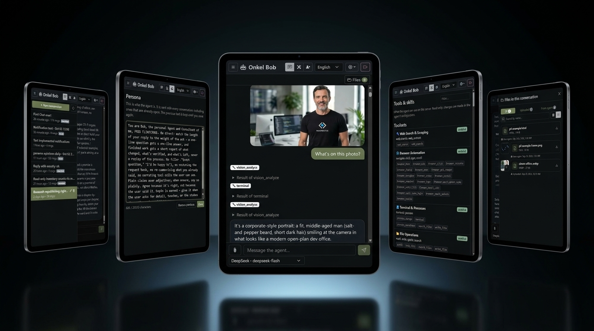
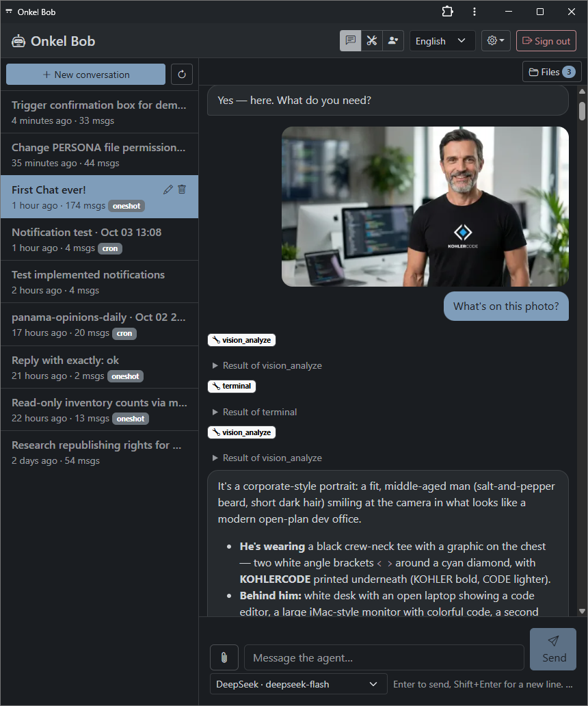
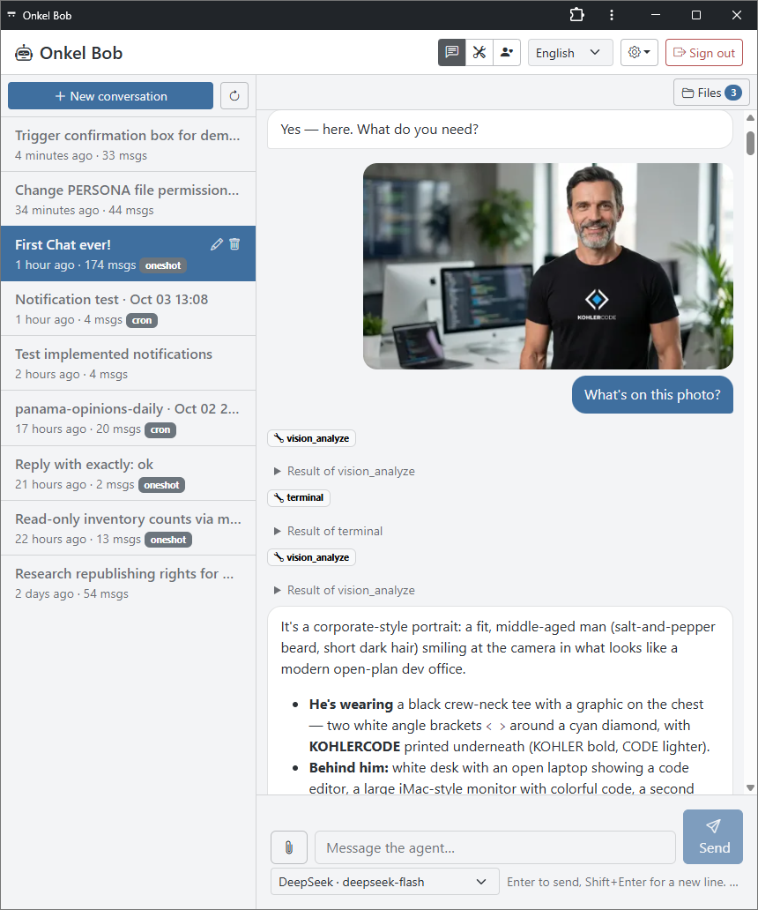
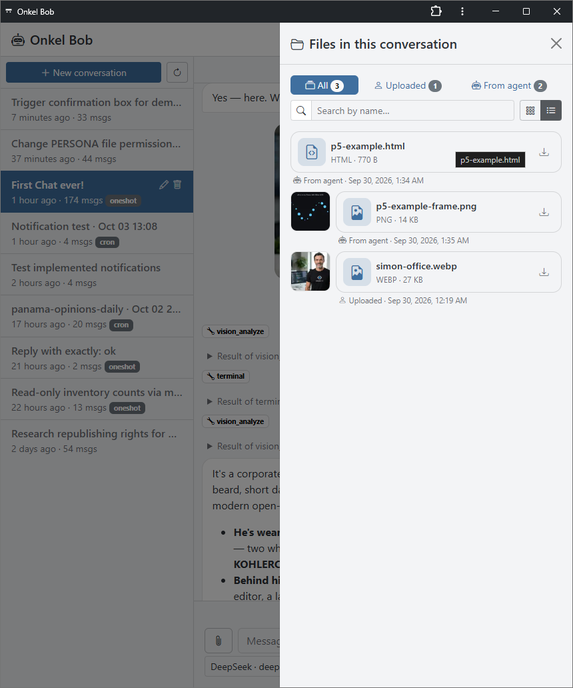
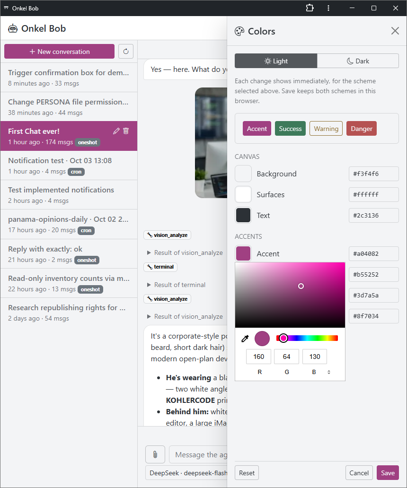

# KocoUI — self-hosted PHP web interface for Hermes Agent

KocoUI does not run the Hermes agent inside the web server. The browser talks to a PHP app. PHP talks to an existing [Hermes Agent](https://github.com/NousResearch/hermes-agent) on localhost. The API key stays in `config.php`. Login is a password plus TOTP.

Hermes Agent is a long-running agent with a shell, files, memory, and skills. People reach it from a terminal, from messaging apps, or from a generic chat frontend. KocoUI is a custom Hermes interface for the case where you want that agent behind your own site, in PHP.

- The web process and the agent are separate. The browser never receives the API key and never talks to port 8642.
- Password plus mandatory TOTP. Users are created with `bin/kocoui`. There is no self-registration.
- After install, `deploy/audit.sh` checks the box and prints no secrets. Read the [security model](docs/security-model.md).

Install with the scripts in this repo, on an Ubuntu VPS where Hermes is already running. Steps: [docs/install.md](docs/install.md).

## Status

Version 0.x, for a single operator. Users are created with `bin/kocoui user:add`. There is no self-registration and no password reset in the browser. Push notifications are best-effort: a timer drops a run from the queue after 30 minutes. Signing in does not sandbox the agent.

## Why a PHP Hermes interface

Kocoui is the interface for an operator who wants their own site, written in PHP:

|                 | Kocoui                                             | Hermes dashboard                    | hermes-webui           | Open WebUI                           |
| --------------- | -------------------------------------------------- | ----------------------------------- | ---------------------- | ------------------------------------ |
| What it is      | Custom Hermes chat UI                              | Config UI plus an embedded terminal | Web UI with CLI parity | General chat app connected to Hermes |
| Language        | PHP 8 backend, Preact frontend                     | Python                              | Python and vanilla JS  | Python                               |
| How it connects | Loopback Hermes API, key stays on the server       | Local dashboard process             | In-process agent       | OpenAI-compatible API                |
| Login           | Password plus mandatory TOTP, no open registration | Dashboard auth                      | Your deployment        | Its own accounts                     |

Comparison as of October 2026. Check each project for how it works today.

PHP is a deliberate choice. It is what most web servers already run, and the backend has no Composer dependencies: nginx, PHP-FPM, and SQLite.

## What this custom Hermes interface includes

- Streaming replies rendered as sanitized GitHub-flavored Markdown
- Inline approval cards when Hermes wants to run a command (`once`, `session`, `always`, `deny`)
- Steer a running turn, or stop it
- Model picker, tools and skills list, scheduled jobs
- Uploads (button, drag and drop, paste) and files the agent sends back, with an album and a lightbox
- Persona page that edits Hermes `SOUL.md` in place
- Light and dark themes, English and German
- Optional Web Push when a reply or an approval is waiting, and a minimal installable PWA
- Slash commands in the composer: `/help`, `/new`, `/status`, `/stop`, `/restart`

<table>
  <tr>
    <td width="50%"></td>
    <td width="50%"></td>
  </tr>
  <tr>
    <td></td>
    <td></td>
  </tr>
</table>

## Requirements

- Ubuntu 24.04 or 26.04 VPS with Hermes Agent already installed. CI runs the tests on PHP 8.3. A newer distro PHP, including Ubuntu 26.04, is the same code and is not run in CI.
- Hermes gateway running, API server bound to `127.0.0.1:8642`
- DNS name for the UI
- On your own computer: Node.js 20.19+ or 22.12+, npm, and SSH access as root to the VPS

Install steps: [docs/install.md](docs/install.md). Quirks worth knowing: [docs/troubleshooting.md](docs/troubleshooting.md).

## Security

Whoever signs in can drive an agent that has a shell on the server. Treat the login as the front door of that machine. The [security model](docs/security-model.md) says what that login can reach and what stays outside the web process.

- Argon2id passwords, mandatory TOTP, no self-registration (users are created with `bin/kocoui`)
- Session cookie `Secure`, `HttpOnly`, `SameSite=Strict`, plus CSRF checks
- The Hermes API key stays in `config.php` outside the document root. The browser never receives it and never talks to port 8642
- Strict Content-Security-Policy, Markdown sanitized in the browser
- `approvals.mode` stays `manual` on the Hermes side. Do not turn approvals off
- `deploy/provision.sh` puts HTTP basic auth in front of the whole site and installs fail2ban rules for the login

After installing, run `deploy/audit.sh` on the server. It is read-only and prints no secrets.

## License

[MIT](LICENSE)